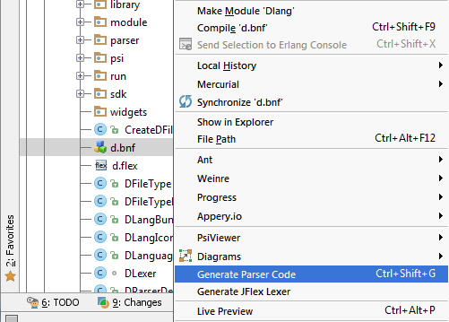
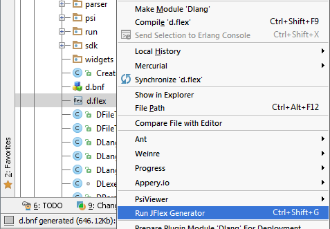

There are Ant build script to package plugin JAR file. But you have to remember that 
Java classes of DLang parser are generated from d.flex and d.bnf rules and one need IntelliJ IDEA to regenerate
these files.

# Pre-requirements
* IntelliJ IDEA (Community edition or Ultimate edition) ( [download](http://www.jetbrains.com/idea/download/) )
* [Grammar-Kit plugin](https://github.com/JetBrains/Grammar-Kit)
* [IntelliJ IDEA Source code](https://github.com/JetBrains/intellij-community) (optional)
* [PsiViewer plugin](http://plugins.intellij.net/plugin/?null&pluginId=227) (optional, but useful for development)

# Build steps
* Import project to IntelliJ IDEA
* Setup Plugin SDK according to [documentation](https://confluence.jetbrains.com/display/IDEADEV/Getting+Started+with+Plugin+Development#GettingStartedwithPluginDevelopment-anchor2)
* Clear `"gen"` directory
* Right click on `"d.bfn"` and select "Generate Parse Code" menu item.

* Right click on `"d.flex"` and select "Run JFlex Generator" menu item.

* Edit `dlang.properties` file: set valid `"jdk.home.idea_jdk"` and `"idea.home"` properties. Both of it should point
  to the IntelliJ IDEA installation directory.
* Now run Ant build with command:

    $> ant

If build is successful you'll find plugin binary: `out/Dlang-x.y.z.jar`
