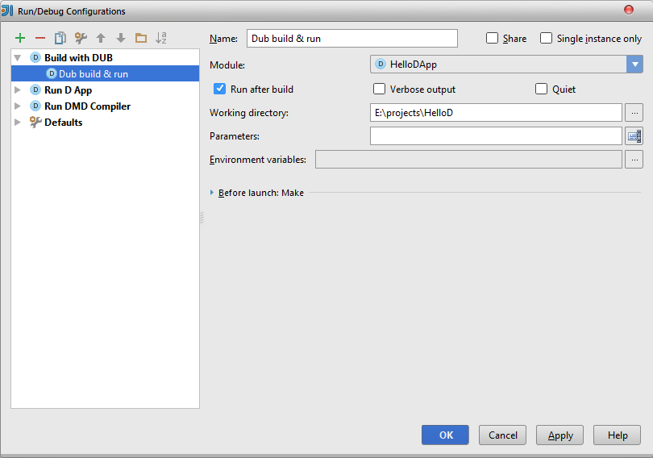

DUB is a build tool for D projects with support for automatically retrieving dependencies and integrating them in
the build process. The design emphasis is on maximum simplicity for simple projects, while providing the opportunity
to customize things when needed.

We recommend to use DUB for your projects. DLang plugins is able to run DUB executable to build and run project.

**Note:** DLang plugin doesn't have configuration file `dub.json` integration. You need to create it manually in
project root folder.

| DUB option | Description |
|:-----------|:------------|
| Module | IDEA Module to build |
| Run after build | Checked by default. If build is successful executable will be started. |
| Verbose output | Put more logs to the console during build. |
| Quiet | Put less logs to the console during build. |
| Working directory | Directory used to run DUB. |
| Parameters | Additional parameters to the DUB. Run `dub help` to see all options. |
