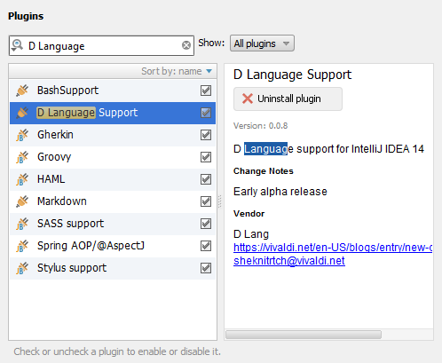

# Using plugins.jetbrains.com

Open "Settings" > "Plugins" and click "Browse repositories ..." button. Now search for text "D Language".
You'll see "D Language Support" plugin in a list. Set checkbox and press "Apply"

# From sources

See [building instructions](Build.md). If you already have build JAR file of DLang plugin open
"Settings" > "Plugins" > "Install Plugins from disk ..." and select your binary plugin file.
