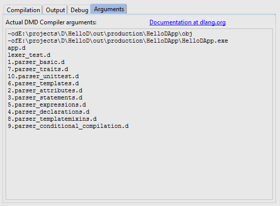

Digital Mars D (DMD) compiler has a lot of settings.
See official [documentation](http://dlang.org/dmd-linux.html#switches).
This is a list of configuration properties with compiler arguments description:

| Compiler option | Description | DMD command line | Configuration section |
|:----------------|:------------|:-----------------|:----------------------|
| Link | Do linking or not | `-c` | Compiler |
| Coverage analysis | Do code coverage analysis | `-cov` | Compiler |
| Allow deprecated features | Allow deprecated features | `-d` | Compiler |
| Generate documentation | Generate documentation in HTML format | `-D` | Output |
| Documentation folder | Specify folder where documentation will be generated | `-Dddocdir` | Output |
| Documentation filename | Filename of a generated HTML file | `-Dffilename` | Output |
| Debug | Compile in debug code | `-debug` | Compiler |
| Symbolic debug library | Set symbolic debug library to name | `-debuglib=name` | Debug |
| Default library | Set default library to name | `-defaultlib=name` | Compiler |
| Module dependencies output | Write module dependencies to filename | `-deps=filename` | Output |
| Add symbolic debug info | Add symbolic debug info | `-g` | Debug |
| Add symbolic debug info, pretend to be C | Add symbolic debug info, pretend to be C | `-gc` | Debug |
| Generate standard stack frame | Always generate standard stack frame | `-gs` | Debug |
| Generate 'header' file | Generate 'header' file | `-H` | Output |
| Header file directory | write 'header' file to directory | `-Hddirectory` | Output |
| Header file name | write 'header' file to filename | `-Hffilename` | Output |
| Imports | Where to look for imports | `-Ipath` | Compiler |
| Ignore unsupported pragmas | Ignore unsupported pragmas | `-ignore` | Compiler |
| Function inlining | Do function inlining | `-inline` | Compiler |
| String imports path | Where to look for string imports | `-Jpath` | Compiler |
| Linker flags | Pass linkerflag to link | `-Llinkerflag` | Compiler |
| Build library | Generate library rather than object files | `-lib` | Compiler |
| Generate linker `.map` file | Generate linker `.map` file | `-map` | Output |
| No array bounds check | Turns off array bounds checking for all functions | `-noboundscheck` | Compiler |
| No floating point references | Do not emit reference to floating point | `-nofloat` | Compiler |
| Optimize | Do optimizations | `-O` | Compiler |
| No object files | Do not write object file | `-o-` | Output |
| Do not strip paths from source file | Do not strip paths from source file | `-op` | Output |
| Profile runtime | Profile runtime performance of generated code | `-profile` | Debug |
| Enforce property syntax | Enforce property syntax | `-property` | Compiler |
| Quiet compiling | Suppress unnecessary DMD messages | `-quiet` | Compiler |
| Release | Compile release version | `-release` | Compiler |
| Unit test | compile in unit tests | `-unittest` | Compiler |
| Verbose | Verbose compiler output | `-v` | Compiler |
| List thread local storage | List all variables going into thread local storage | `-vtls` | Compiler |
| Warnings | Enable warnings | `-w` | Compiler |
| Informational warnings | Enable informational warnings | `-wi` | Compiler |
| Generate JSON | Generate JSON file | `-X` | Output |
| JSON filefilename | Write JSON file to filename | `-Xffilename` | Output |

You can see all actual DMD arguments on "Arguments" tab:

