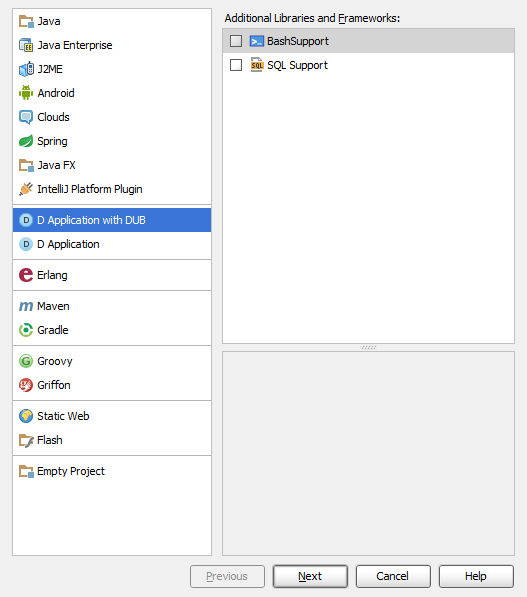
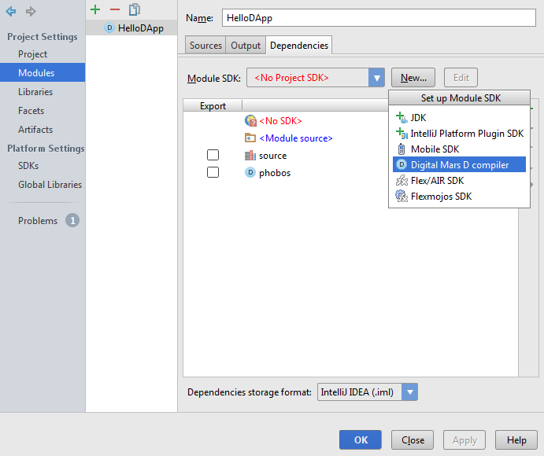
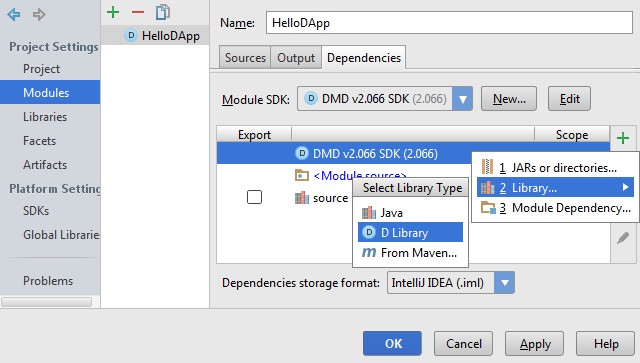

# Installation

1. Get latest DLang plugin binary;
2. Open Settings > Plugins > Install plugin from disc...;
3. Select downloaded `Dlang-x.y.z.jar` file;
4. Restart IntelliJ IDEA;
5. Return true;

# Features

1. Class Navigation (Ctrl + N);
2. Compilation with DMD or DUB.

# Create new project

You could create two types of projects: "D Application" or "D Application with DUB".
The difference is that "D Application" has "Run DMD Compiler" configuration while the second one has "Build with DUB".
[DUB](http://code.dlang.org/) - is D Build and Package manager. It's preferable for usage instead of a pure DMD compiler.
See details on [Github](https://github.com/D-Programming-Language/dub).

1. Click "File" > "New project"
2. Select of two options: "D Application" or "D Application with DUB"
3. Write D Language code and have fun.

# Setup SDK
To compile project with DMD you need to setup DMD SDK. Open project structure (Ctrl+Alt+Shift+S).
Select D Language module and add SDK:

You will be prompted to select folder where `dmd` executable is located.
After that you can build project with DMD.

# Add libraries
To add D Language library (source code or LIB file) open project structure (Ctrl+Alt+Shift+S), select D Lanaguage
module and click `+` button:

Note: these settings affects only DMD compilation. While DUB reads project dependencies from `dub.json` file.
