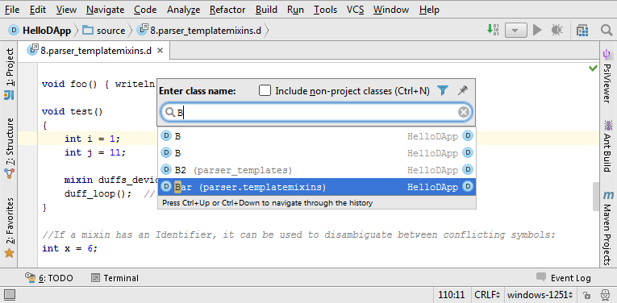

# D Language plugin for IntelliJ IDEA

This is IntelliJ IDEA plugin for D Language support.

The **D programming language** is an object-oriented, imperative, multi-paradigm system programming language created by
Walter Bright of Digital Mars and Andrei Alexandrescu. Though it originated as a re-engineering of C++,
D is a distinct language, having redesigned some core C++ features while also taking inspiration from other languages,
notably Java, Python, Ruby, C#, and Eiffel.

See [dlang.org](http://dlang.org/), [DMD compiler sources](https://github.com/D-Programming-Language/dmd),
[D packages registry](http://code.dlang.org/).

### Current state

It's an early release. Only a few features are implemented: Syntax highlighting, Compilation using external tools,
Class navigation. A lot of work lies ahead.

#### Contributing

Any kind of contribution is welcomed; please see [CONTRIBUTING.md](CONTRIBUTING.md) for details.

### Roadmap

1. Code formatting;
2. Parsing error handling;
3. Code navigation among variables, functions, methods, templates, modules, etc;
4. Autocomplete for names and keywords;
5. Inspections, inspections, inspections! IDEA must check variables types, functions and methods arguments, namespace
visibility, templates validations, do immutability checks and lot of other inspections;
6. Application debugging;
7. [DUB](http://code.dlang.org/about) build system integration.
